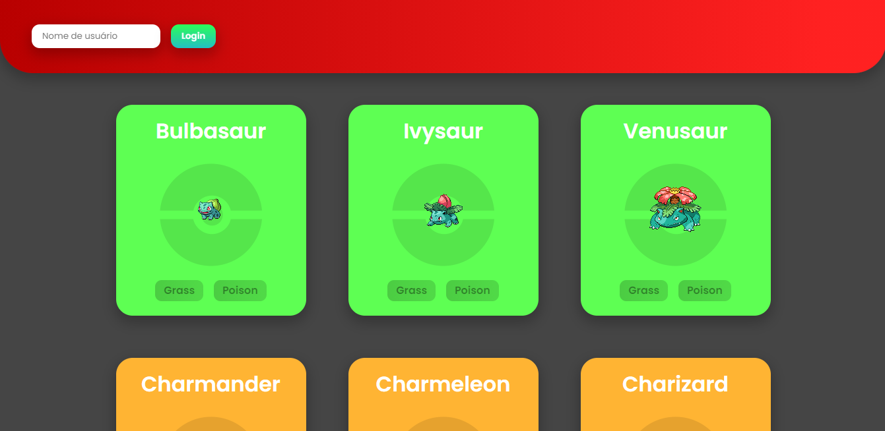
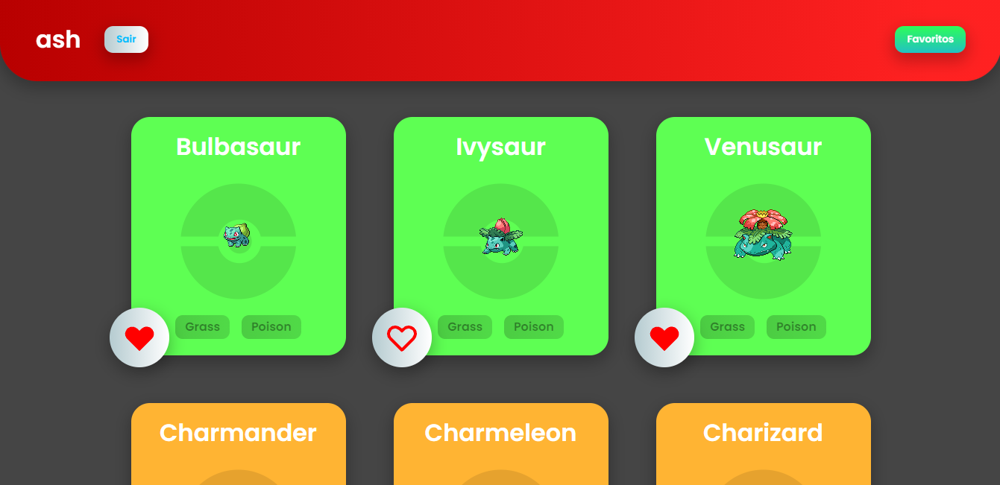

# Sobre o Projeto

É uma Pokedex que lista os Pokémons e permite favoritá-los. Foi feito durante para o Processo Treinee da [CJR](https://www.cjr.org.br/), para treinar o uso da biblioteca [React](https://pt-br.reactjs.org/).

## Preview

* [Demo](https://cjr-pokedex-exercise.vercel.app/)




## Tecnologias

* ReactJS
* Styled Components
* React Router
* Axios

# Instalação

* Você precisará ter instalado no seu computador: [Git](https://git-scm.com/), [Node](https://nodejs.org/en/).

* Primeiramente, é necessário clonar o repositório.

```
git clone https://github.com/RicardoSXAV/cjr-pokedex-exercise
```
* Após clonar o repositório, baixe as dependências usando o NPM ou o Yarn.

```
npm install
```
* Use ```npm start```/```yarn start``` para inicializar o projeto.
